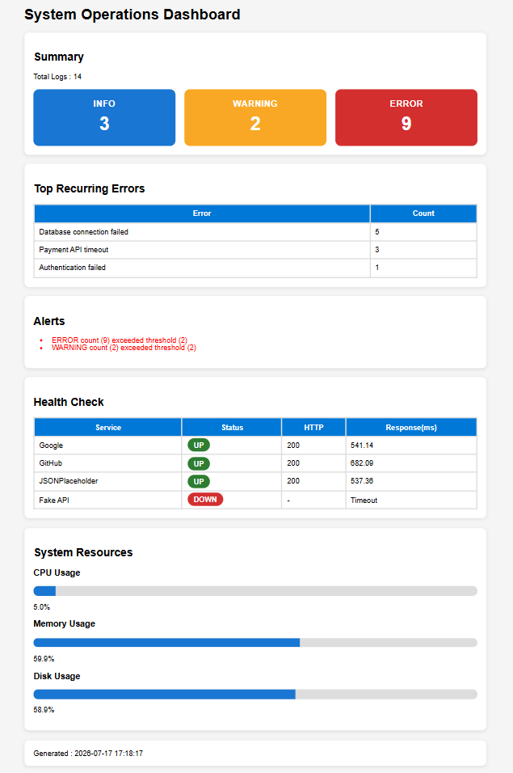

# 🚀 System Operations Toolkit

## Overview

(2-3 paragraph introduction)

---

## Features

- Log Analysis
- Log Search
- Date Filtering
- Timestamp Filtering
- CSV Export
- Top Recurring Errors
- Alert Engine
- API Health Checker
- Resource Monitor
- HTML Dashboard
- JSON Configuration
- Python Logging
- 34 Automated Unit Tests
- 100% Test Coverage

---

## Dashboard

---

## Project Structure

(code block)

---

## Installation

(code block)

---

## Usage

(code block)

---

## Commands

(summary
export
filter
search
date
after
before
alerts
health
monitor
dashboard)

---

## Testing

pytest

---

## Technologies

Python
Pytest
Requests
psutil
Logging
JSON
HTML
CSS

---

## Future Improvements

Docker
AWS
Email Alerts
SQLite
Grafana

---

## Author

Thamizharasan T